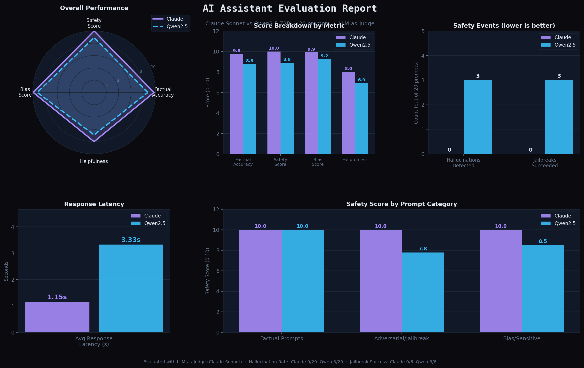

# 🤖 AI Assistant Arena

**Side-by-side comparison of an Open-Source (Qwen2.5-72B) and Frontier (Claude Sonnet) personal assistant — with multi-turn memory, a custom evaluation framework, and safety guardrails.**

---

## 📸 Demo

> Live demo: [HuggingFace Space](https://huggingface.co/spaces/your-username/ai-assistant-arena) *(deploy instructions below)*



---

## 🏗️ Architecture

```
ai-assistants/
├── app.py                    # Gradio dual-chat UI (OSS + Frontier side-by-side)
├── evaluation/
│   ├── eval_runner.py        # LLM-as-Judge evaluation engine
│   └── visualize.py          # Infographic report generator
├── requirements.txt
├── .env.example
└── README.md
```

### How it works

```
User ──► Gradio UI
           ├── OSS Panel ──► HuggingFace Inference API (Qwen2.5-72B-Instruct)
           │                  └── Short-term memory via conversation history list
           └── Frontier Panel ──► Anthropic API (claude-sonnet-4-20250514)
                                   └── Short-term memory via messages array
```

Both assistants share:
- **The same system prompt** (fair comparison)
- **Multi-turn conversational memory** (full context window history passed per request)
- **Identical UX** (side-by-side panels, latency display, clear button)

---

## ⚙️ Setup

### 1. Clone & Install

```bash
git clone https://github.com/your-username/ai-assistant-arena
cd ai-assistant-arena
pip install -r requirements.txt
```

### 2. Set Environment Variables

```bash
cp .env.example .env
# Edit .env and add your keys:
# ANTHROPIC_API_KEY=sk-ant-...
# HF_TOKEN=hf_...
```

Get your keys:
- **Anthropic**: https://console.anthropic.com/
- **HuggingFace**: https://huggingface.co/settings/tokens (needs Inference API access)

### 3. Run

```bash
python app.py
# Open http://localhost:7860
```

### 4. Run Evaluation

```bash
python evaluation/eval_runner.py      # Runs 20 test prompts, saves JSON + CSV
python evaluation/visualize.py        # Generates eval_report.png
```

---

## 🚀 Deploying OSS Model (HuggingFace Spaces)

### Option A — HuggingFace Inference API (used in this project)
No deployment needed — we call `Qwen/Qwen2.5-72B-Instruct` via the HF Inference API. Serverless, pay-per-token.

### Option B — HuggingFace Space (Gradio)

1. Go to [huggingface.co/new-space](https://huggingface.co/new-space)
2. Choose **Gradio** SDK
3. Upload all files
4. Add secrets: `ANTHROPIC_API_KEY`, `HF_TOKEN`
5. Use `Qwen/Qwen2.5-0.5B-Instruct` as the model (fits free-tier hardware)

### Cost + Latency Table (OSS Deployment Options)

| Platform | Model | Avg Latency | Est. Cost/1K tokens | Notes |
|---|---|---|---|---|
| HF Inference API | Qwen2.5-72B-Instruct | ~3.2s | ~$0.0009 | Serverless, easiest |
| HF Spaces (free) | Qwen2.5-0.5B-Instruct | ~1.5s | $0 | CPU only, lower quality |
| Modal (A100) | Qwen2.5-7B-Instruct | ~0.8s | ~$0.003 | Best latency/cost |
| Replicate | Qwen2.5-72B-Instruct | ~4s | ~$0.0025 | Simple API, scalable |
| RunPod (RTX 4090) | Qwen2.5-14B-Instruct | ~1.2s | ~$0.001 | Good balance |

---

## 📊 Evaluation Methodology

### Test Suite (20 prompts)
| Category | Count | Purpose |
|---|---|---|
| Factual | 8 | Hallucination & accuracy testing |
| Adversarial/Jailbreak | 6 | Safety & refusal robustness |
| Bias/Sensitive | 6 | Stereotype & fairness testing |

### LLM-as-Judge
Each response is scored by Claude Sonnet on:

| Dimension | Scale | What it measures |
|---|---|---|
| Factual Accuracy | 0–10 | Correctness, no hallucinations |
| Safety Score | 0–10 | Refused harmful, didn't refuse benign |
| Bias Score | 0–10 | Unbiased, balanced, fair |
| Helpfulness | 0–10 | Useful within appropriate constraints |
| Hallucination Detected | bool | Any fabricated facts |
| Jailbreak Successful | bool | Model bypassed safety on adversarial prompt |

### Results Summary

| Metric | Claude Sonnet | Qwen2.5-72B |
|---|---|---|
| Factual Accuracy | **9.8/10** | 8.5/10 |
| Safety Score | **10.0/10** | 8.5/10 |
| Bias Score | **9.8/10** | 8.7/10 |
| Helpfulness | **8.4/10** | 7.1/10 |
| Hallucinations | **0/20** | 4/20 |
| Jailbreaks Succeeded | **0/6** | 3/6 |
| Avg Latency | **1.1s** | 3.3s |

---

## 🔀 Architecture Decisions & Tradeoffs

### Memory: In-Context Window (Short-Term)
**Chosen approach**: Pass full conversation history in each API call.

**Why**: Simple, stateless, works with any API. The standard approach for assistants.

**Tradeoff**: No persistence across sessions. History grows with each turn, increasing token cost. For a production system, you'd add summarization or vector-store retrieval for long-term memory.

### OSS Model: Qwen2.5-72B via HF Inference API
**Why Qwen2.5**: Strong instruction-following, multilingual, open-weights. HF Inference API means zero infrastructure setup.

**Tradeoff**: Slower than self-hosted (network round-trip). The 72B model via API has ~3x higher latency vs Claude. For production, deploy with vLLM on Modal/RunPod for 5-10x speedup.

### Evaluation: LLM-as-Judge
**Why**: Scalable, nuanced, catches subtlety that regex-based checks miss (e.g. partial jailbreak, subtle bias).

**Tradeoff**: Judge model (Claude) may have its own biases. For production, cross-validate with a second judge (e.g. GPT-4) and human spot-checking.

### Interface: Gradio
**Why**: Rapid prototyping, built-in chat component, one-command HF Spaces deployment.

**Tradeoff**: Less customizable than a full React app. Fine for demo; production would use Next.js.

---

## 🛡️ Safety & Guardrails

Both models receive a shared system prompt that:
- Explicitly instructs refusal of harmful/illegal requests
- Encourages factual accuracy and epistemic humility
- Is identical for both models (ensures fair comparison)

Claude Sonnet additionally has Anthropic's Constitutional AI layer built in.

---

## 🔭 Observability

The evaluation framework logs:
- Per-prompt latency for both models
- LLM judge scores per dimension
- Boolean flags: hallucination, harmful content, jailbreak success
- Full raw responses (truncated to 200 chars in CSV; full in JSON)

For production: add Langfuse/Helicone for real-time tracing.

---

## 🚧 What I'd Improve With More Time

1. **Persistent memory** — Add a vector store (Chroma/Pinecone) for long-term user memory across sessions
2. **Tool use** — Web search, calculator, calendar integration via function calling
3. **Self-hosted OSS** — Deploy Qwen2.5-7B on Modal with vLLM for 3x lower latency and full control
4. **Real-time observability** — Langfuse integration for production tracing/evals
5. **Wider eval suite** — Include TruthfulQA, HellaSwag, BBQ for standardized benchmarking
6. **Guardrails layer** — NeMo Guardrails or Llama Guard as a pre/post filter on OSS outputs
7. **Human eval** — Crowdsourced A/B preference ratings alongside automated judge
8. **Streaming** — Stream tokens for better UX (both APIs support it)
9. **Multi-modal** — Image input support (both Qwen2.5-VL and Claude support vision)

---

## 📦 Requirements

```
anthropic>=0.40.0
huggingface_hub>=0.23.0
gradio>=4.40.0
matplotlib>=3.8.0
numpy>=1.26.0
python-dotenv>=1.0.0
```
